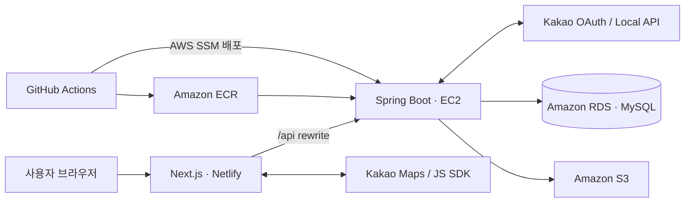

# Moigo (모이고)

> 함께 고르고, 함께 완성하는 여행 플래너

[](https://github.com/Groom-team2-project/Groom-Semi3-Project-Team2/actions/workflows/ci.yml)
[](https://openjdk.org/projects/jdk/21/)
[](https://spring.io/projects/spring-boot)
[](https://nextjs.org/)

**서비스:** [https://moigo.netlify.app](https://moigo.netlify.app)

Moigo는 여러 사람이 여행을 준비하며 흩어 놓기 쉬운 장소 후보, 투표, 의견과 일정을 하나의 흐름으로 관리하는 협업형 여행 계획 서비스입니다. 카카오 계정으로 시작해 멤버를 초대하고, 함께 장소를 탐색·선정한 뒤 날짜별 일정과 이동 경로를 완성할 수 있습니다.

## 주요 기능

| 영역 | 기능 |
| --- | --- |
| 인증·프로필 | 카카오 OAuth 로그인, JWT 인증·재발급, 닉네임 및 S3 프로필 이미지 관리 |
| 여행 계획 | 여행 생성·조회·수정·삭제, 기간 및 여행 유형 관리 |
| 멤버·초대 | 초대 링크 참여, OWNER·EDITOR·VIEWER 권한 관리, 멤버 내보내기·탈퇴 |
| 장소 | 카카오 장소 검색, 카테고리·지도 영역 검색, 후보 장소 저장 및 지도 표시 |
| 투표 | 단일·복수 선택 투표 생성, 참여, 결과 확인, 수정·삭제 및 마감 처리 |
| 일정 | 날짜별 일정 생성·수정·삭제, 순서 변경, 장소 연결 및 타임라인·이동 경로 확인 |
| 댓글 | 일정 댓글 작성·삭제, 좋아요 및 커서 기반 페이지 조회 |
| 활동 기록 | 일정·투표·멤버·댓글 변경 이력 조회, 개인 활동과 계획별 활동 분리 |

## 서비스 흐름

1. 카카오 계정으로 로그인합니다.
2. 여행 기간과 유형을 정해 계획을 만듭니다.
3. 초대 링크로 동행자를 초대하고 역할을 설정합니다.
4. 카카오 지도에서 장소를 검색해 후보로 저장합니다.
5. 투표와 댓글로 방문 장소를 결정합니다.
6. 선택한 장소를 날짜와 시간에 맞춰 일정으로 구성합니다.
7. 타임라인과 지도에서 완성된 일정과 이동 경로를 확인합니다.

## 기술 스택

| 구분 | 기술 |
| --- | --- |
| Frontend | Next.js 16.3, React 19, TypeScript 5, Tailwind CSS 4 |
| Backend | Java 21, Spring Boot 3.5.16, Spring Security, Spring Data JPA, Bean Validation |
| Authentication | Kakao OAuth 2.0, JWT Access Token, HttpOnly Refresh Token Cookie |
| Database | MySQL 8.4, Flyway |
| External API | Kakao Local API, Kakao Maps JavaScript SDK, Kakao JavaScript SDK |
| Storage | Amazon S3 |
| Infrastructure | Netlify, AWS EC2, Amazon RDS, Amazon ECR, AWS Systems Manager, Docker Compose |
| CI/CD | GitHub Actions, Gradle, ESLint, Next.js Build |
| Test | JUnit 5, Spring Boot Test, Spring Security Test, Node.js Test Runner |

## 아키텍처



- 브라우저의 `/api` 요청은 Next.js rewrite를 통해 백엔드로 전달됩니다.
- 액세스 토큰은 메모리에서 사용하고, 리프레시 토큰은 HttpOnly 쿠키로 관리합니다.
- 데이터베이스 스키마는 Flyway 마이그레이션으로 버전 관리합니다.
- `develop` push 시 테스트와 프론트 빌드를 통과한 백엔드 이미지만 ECR에 올리고, AWS SSM을 통해 EC2에 배포합니다.
- 운영 데이터베이스 연결은 RDS 인증서와 호스트 이름을 검증하도록 구성했습니다.

## 프로젝트 구조

```text
.
├── frontend/                       # Next.js 프론트엔드
│   └── src/
│       ├── app/                    # App Router 페이지
│       ├── components/             # 공통·도메인 UI 컴포넌트
│       ├── context/                # 인증 전역 상태
│       └── lib/                    # API 클라이언트와 공통 유틸리티
├── src/main/java/com/groom/moigo/
│   ├── domain/
│   │   ├── activity/               # 활동 기록
│   │   ├── auth/                   # 카카오 로그인·JWT
│   │   ├── comment/                # 댓글·좋아요
│   │   ├── place/                  # 장소 검색·저장
│   │   ├── plan/                   # 계획·멤버·초대
│   │   ├── schedule/               # 일정
│   │   ├── user/                   # 사용자·프로필
│   │   └── vote/                   # 투표
│   └── global/                     # 보안·예외·공통 응답
├── src/main/resources/db/migration # Flyway 마이그레이션
├── src/test/                       # 백엔드 테스트
├── deploy/                         # EC2 배포용 Compose와 배포 스크립트
├── docs/                           # 도메인·성능 검증 문서
├── performance/                    # k6·검증 스크립트
└── .github/workflows/ci.yml        # CI/CD 파이프라인
```

## 로컬 실행

### 요구 사항

- Java 21
- Node.js 22.13 이상
- Docker Desktop과 Docker Compose
- 카카오 개발자 애플리케이션 키

### 1. 환경변수 준비

```powershell
Copy-Item .env.example .env
Copy-Item frontend/.env.example frontend/.env.local
```

루트 `.env`에는 카카오 OAuth·Local API 키와 JWT 설정을, `frontend/.env.local`에는 카카오 JavaScript 키를 입력합니다. 비밀값이 포함된 환경변수 파일은 커밋하지 않습니다.

주요 환경변수는 다음과 같습니다.

| 파일 | 변수 | 용도 |
| --- | --- | --- |
| `.env` | `KAKAO_CLIENT_ID`, `KAKAO_CLIENT_SECRET`, `KAKAO_REDIRECT_URI` | 카카오 로그인 |
| `.env` | `KAKAO_REST_API_KEY` | 카카오 장소 검색 |
| `.env` | `JWT_SECRET` | JWT 서명 |
| `.env` | `DB_USERNAME`, `DB_PASSWORD` | 로컬 MySQL 계정 |
| `frontend/.env.local` | `NEXT_PUBLIC_KAKAO_JS_KEY` | 지도·공유 SDK |
| `frontend/.env.local` | `BACKEND_URL` | Next.js가 요청을 전달할 백엔드 주소 |

### 2. 백엔드와 로컬 인프라 실행

```powershell
docker compose -f docker-compose.local.yml up -d --build
docker compose -f docker-compose.local.yml ps
```

백엔드는 `http://localhost:8080`에서 실행됩니다. MySQL과 S3 호환 개발 환경인 LocalStack도 함께 시작되며, 서버 상태는 `http://localhost:8080/actuator/health`에서 확인할 수 있습니다.

Docker 대신 로컬 JVM으로 백엔드를 실행하려면 MySQL을 먼저 준비한 뒤 다음 명령을 사용합니다.

```powershell
.\gradlew.bat bootRun
```

### 3. 프론트엔드 실행

```powershell
Set-Location frontend
npm ci
npm run dev
```

브라우저에서 `http://localhost:3000`으로 접속합니다.

## 테스트와 품질 검사

### Backend

```powershell
.\gradlew.bat clean test
```

### Frontend

```powershell
Set-Location frontend
npm test
npm run lint
npm run build
```

GitHub Actions는 `develop`과 `main`의 push 및 PR에서 백엔드 테스트, 프론트엔드 린트와 프로덕션 빌드를 실행합니다.

## 배포

- **Frontend:** Netlify가 Next.js 애플리케이션을 빌드·배포합니다.
- **Backend:** GitHub Actions가 Docker 이미지를 Amazon ECR에 업로드합니다.
- **Delivery:** AWS Systems Manager가 EC2의 배포 파일을 검증·동기화하고 새 이미지를 실행합니다.
- **Health check:** 새 컨테이너가 Actuator 헬스체크를 통과한 경우에만 재시작 정책을 활성화합니다.
- **Database:** Amazon RDS for MySQL을 사용하며 TLS 인증서와 호스트 이름을 검증합니다.

자세한 운영 설정은 [`deploy/compose.yml`](deploy/compose.yml), [`deploy/deploy.sh`](deploy/deploy.sh), [CI/CD 워크플로](.github/workflows/ci.yml)에서 확인할 수 있습니다.

## 문서

- [계획 도메인 명세](docs/plan-spec.md)
- [장소 도메인 명세](docs/places-spec.md)
- [일정 도메인 명세](docs/schedules-spec.md)
- [활동 기록 정책](docs/activity-log-spec.md)
- [활동 기록 조회 성능 검증](docs/performance/activity-log-benchmark.md)

---

**여행 계획의 시작부터 결정까지, 모두가 함께.**
