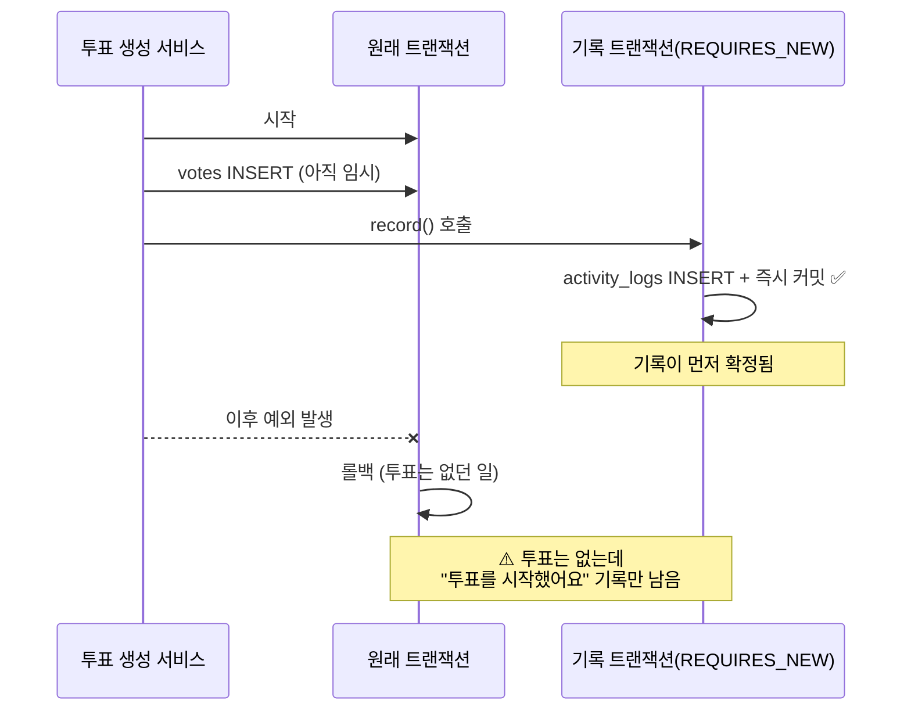
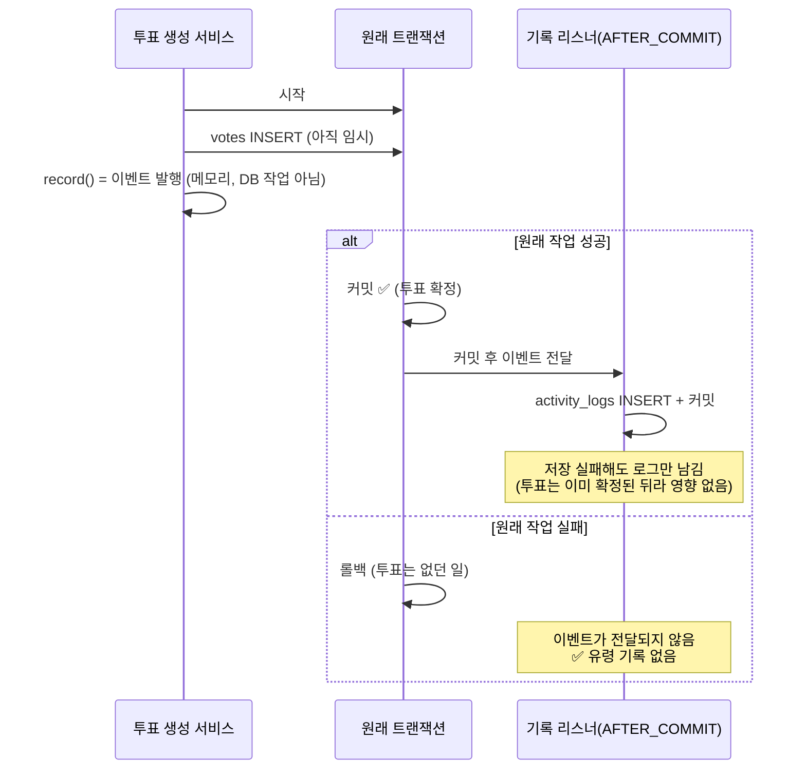

# 활동 기록 정책

## 1. 목적

활동 기록은 협업 계획의 변경 흐름을 확인하고, 사용자가 자신의 작업 이력을 다시 찾을 수 있도록 제공한다. 공유 활동에 표시할지의 기준은 **다른 멤버의 여행 준비에 실제 영향을 주는가**이다.

같은 로그를 두 화면에서 목적에 맞게 다르게 보여준다.

- **계획 최근 활동**: 계획 멤버가 함께 알아야 할 주요 변화만 표시한다.
- **내 활동 내역**: 내가 수행한 변경을 모두 확인한다.

로그 원본은 모두 `activity_logs`에 저장한다. 화면별로 별도 테이블을 만들지 않는다.

---

## 2. 화면별 표시 정책

| 이벤트 | 계획 최근 활동 | 내 활동 내역 | 비고 |
| --- | :---: | :---: | --- |
| 일정 생성 | O | O | 공동 계획에 새 일정이 생긴 사실 공유 |
| 일정 시간·장소·날짜 변경 | O | O | 여행 일정과 준비에 직접 영향 |
| 일정 제목·메모 수정 | X | O | 세부 편집은 공유 피드의 노이즈를 줄이기 위해 제외 |
| 일정 표시 순서 변경 | X | X | 여러 일정이 한 번에 바뀌어 대상을 특정할 수 없어 기록하지 않음(6절) |
| 일정 삭제 | O | O | 사라진 일정은 모든 멤버가 확인해야 함 |
| 투표 생성 | O | O | 새로운 의사결정 시작 공유 |
| 투표 마감 | O | O | 결과 확인이 필요한 주요 상태 변경 |
| 투표 참여·재투표·취소 | X | X | 익명성 보호를 위해 참여자 활동을 남기지 않음 |
| 투표 내용·선택지 변경·삭제 | O | O | 이미 참여한 멤버의 의사결정에 영향 |
| 멤버 참여·나가기·역할 변경 | O | O | 협업 구성 변화 공유 |
| 초대 링크 생성·재발급·취소 | X | X | 링크 관리 화면의 상태 표시로 충분 |
| 댓글·답글 작성 | O | O | 일정 논의가 새로 생긴 사실 공유 |
| 댓글 삭제 | X | O | 대화 피드의 불필요한 노출 방지 |
| 댓글 좋아요 | X | O | 좋아요 취소는 활동으로 기록하지 않음 |

초대 링크의 생성·재발급·취소는 특정 멤버의 참여가 아니라 공용 링크 상태를 바꾸는 관리 작업이다. 최근 활동 대신 멤버·초대 화면에서 링크의 `활성`, `만료`, `취소됨` 상태를 표시한다.

---

## 3. API

### 3.1 계획 공유 활동

```http
GET /api/v1/plans/{planId}/activities
```

- 해당 계획의 참여 멤버만 조회할 수 있다.
- 2절에서 계획 최근 활동이 `O`인 항목만 최신순으로 반환한다.
- 일정 수정은 시간·장소·날짜 변경만 공유 활동으로 기록한다. 제목·메모 변경은 내 활동에만 기록하고,
  표시 순서 변경은 기록하지 않는다(6절).
- 계획 홈의 최근 활동과 전체 활동 화면에서 사용한다.
- `size`(기본 20, 최대 100)와 `cursorCreatedAt`, `cursorLogId`를 함께 사용해 다음 페이지를 조회한다.

### 3.2 내 활동

```http
GET /api/v1/users/me/activities
```

- 로그인한 사용자가 직접 수행한 활동을 최신순으로 반환한다.
- 수정·삭제를 포함한다.
- 응답에는 이동을 위해 `planId`, `planTitle`, `targetType`, `targetId`를 포함한다.
- 프로필의 **내 활동 내역** 화면에서 사용한다.
- `size`(기본 20, 최대 100)와 `cursorCreatedAt`, `cursorLogId`를 함께 사용해 다음 페이지를 조회한다.

두 API 모두 다음 형태로 응답한다. 같은 시각에 생성된 로그도 누락·중복 없이 이어서 조회할 수 있도록 `createdAt`과 `logId`를 복합 커서로 사용한다.

```json
{
  "activities": [],
  "nextCursorCreatedAt": "2026-08-19T20:00:00",
  "nextCursorLogId": 123,
  "hasNext": true
}
```

---

## 4. 이동 및 삭제된 대상 처리

활동 항목은 가능하면 원래 대상 화면으로 이동한다.

| 대상 | 이동 위치 |
| --- | --- |
| 일정 | 일정 상세 |
| 투표 | 투표 상세 |
| 댓글·답글 | 해당 일정 상세의 해당 댓글 위치 |
| 멤버 | 멤버 관리 화면 |

대상이 삭제되어 이동할 수 없으면 화면을 전환하지 않고 다음 토스트를 표시한다.

```text
삭제되었거나 더 이상 볼 수 없는 활동이에요.
```

삭제된 대상을 가리키는 활동은 눌러보기 전에 목록에서 미리 구분해 보여준다. 응답의 `targetDeleted`가
`true`면 흐리게 그리고 클릭을 막는다. 요약만 봐서는 삭제된 걸 알 수 없는 경우(예: 삭제된 댓글의
"댓글을 남겼어요")에는 시각 옆에 `삭제된 댓글이에요`를 같이 보여준다.
`targetDeleted`는 댓글만 확인한다. 댓글은 지워도 로그가 남기 때문이고, 나머지 대상은 항상 `false`다.

---

## 5. 구현 원칙

1. 상태 변경과 같은 트랜잭션 안에서, 변경 코드 다음에 `ActivityLogService.record()`를 호출한다.
   `record()`는 이벤트만 발행하며, 실제 저장은 트랜잭션이 커밋된 뒤 리스너가 한다(7절).
2. 기록 실패가 원래 도메인 작업에 영향을 주지 않는 것은 활동 기록 리스너가 한 곳에서 보장한다.
   도메인 쪽에서 트랜잭션 정책을 따로 검토할 필요 없이 `record()`만 호출하면 된다.
3. `summary`는 화면에 바로 표시할 수 있는 짧은 문장으로 저장한다.
4. 댓글 활동의 `targetType`은 `COMMENT`로 저장한다. 활동 조회 시 댓글의 `scheduleId`를 함께 내려 댓글 위치로 이동할 수 있게 한다.
5. 새 활동 타입을 추가하면 Java enum, Flyway 마이그레이션, 프론트 `ActivityType`, 문서를 함께 수정한다.

---

## 6. 도메인별 기록 현황

모든 도메인의 활동 기록 연동이 완료됐다. 도메인별로 기록하는 액션은 다음과 같다.

- 일정: 생성·시간/장소/날짜 변경·삭제는 공유 활동(`SCHEDULE_CREATED` / `SCHEDULE_UPDATED` / `SCHEDULE_DELETED`),
  제목·메모 변경은 `SCHEDULE_DETAIL_UPDATED`로 내 활동에만 기록
- 투표: 생성·마감·내용/선택지 변경·삭제 기록(`VOTE_CREATED` / `VOTE_CLOSED` / `VOTE_UPDATED` / `VOTE_DELETED`,
  마감은 스케줄러 자동 마감 포함), 참여·재투표·취소는 기록하지 않음
- 계획·멤버·초대: 멤버 참여·나가기·역할 변경 기록(`MEMBER_JOINED` / `MEMBER_LEFT` / `MEMBER_ROLE_CHANGED`).
  초대 링크 상태 변경은 기록하지 않음
- 댓글: 작성·답글 작성은 공유 활동(`COMMENT_CREATED`), 삭제와 좋아요는 내 활동에만 기록
  (`COMMENT_DELETED` / `COMMENT_LIKED`, 좋아요 취소는 기록하지 않음)
- 활동 기록: 계획 공유 조회 필터, 내 활동 조회, 대상 이동 정보 제공

예외: 일정 표시 순서 변경은 한 번에 여러 일정이 바뀌어 어느 일정을 가리켜야 할지 정할 수 없어
기록하지 않는다.

---

## 7. 활동 기록을 원래 작업과 분리해 저장하는 방법

기록 저장이 실패해도 원래 작업(댓글 작성, 투표 생성 등)은 성공해야 한다(5절 2항). 같은 트랜잭션에
넣으면 기록 실패가 원래 작업까지 취소시키므로(예외를 잡아도 롤백 표시는 안 지워짐), 저장을 분리해야 한다.

### 7.1 전: `REQUIRES_NEW`로 그 자리에서 저장

원래 작업 도중에 별도 트랜잭션을 열어 즉시 저장했다. 원래 작업은 보호되지만, **기록이 원래 작업보다
먼저 확정**되는 게 문제였다.



- 원래 작업이 뒤에 롤백되면 일어나지 않은 일의 기록만 남는다.
- 요청 하나가 DB 커넥션 두 개를 동시에 쓴다.

### 7.2 후: 커밋 뒤에 이벤트 리스너가 저장

`record()`는 저장하지 않고 이벤트만 발행한다. `@TransactionalEventListener(AFTER_COMMIT)` 리스너가
**원래 트랜잭션이 실제로 커밋된 뒤에만** 받아서 저장한다.



- 롤백되면 이벤트 자체가 전달되지 않으므로(스프링 보장) 유령 기록이 생기지 않는다.
- 저장은 원래 트랜잭션이 끝난 뒤라 커넥션을 동시에 두 개 쓰지 않는다.

리스너 쪽 주의점 세 가지. AFTER_COMMIT 시점의 기본 트랜잭션은 이미 커밋을 끝낸 상태라 `REQUIRED`로
합류하면 저장이 반영되지 않으므로 `REQUIRES_NEW`로 새 트랜잭션을 열어야 한다. 트랜잭션 밖에서
발행된 이벤트는 기본값으로는 조용히 버려지므로 `fallbackExecution = true`로 즉시 실행되게 했다.
그리고 저장 트랜잭션은 Annotation이 아니라 `TransactionTemplate`으로 연다. Annotation이 방식은 커밋이
메서드 리턴 후에 일어나 커밋 단계 예외가 `catch`를 벗어나고, AFTER_COMMIT 리스너의 예외는 호출자까지
전파되므로 이미 커밋된 도메인 작업의 요청이 실패한 것처럼 보일 수 있다.

### 7.3 저장이 실패하는 경우

리스너 안에서 예외를 잡아 로그만 남기므로, 아래 경우에도 원래 작업에는 영향이 없다.

- **새 액션 타입을 코드에만 추가하고 마이그레이션을 안 올렸을 때.** `action_type`은 DB에 정해둔 값 목록
  중에서만 고를 수 있어서, 목록에 없는 값은 저장이 거부된다.
- **DB에 연결할 통로가 없을 때.** 커넥션 풀이 바닥나면 기다리다 실패한다.
- **DB가 재시작되거나 네트워크가 잠깐 끊겼을 때.**
- **기록이 가리키는 계획이나 사용자가 없을 때.** 실제로 있는 행만 가리키도록 DB가 막고 있다.
  운영에서는 드물고 주로 테스트에서 난다.

### 7.4 남은 한계

- 실패하면 로그만 남고 다시 시도하지 않는다. 기록이 사라져도 그냥 넘어간다.
- 커밋 직후 서버가 죽으면 리스너가 실행되지 못해 그 기록은 사라진다.

재시도나 outbox 같은 보완을 더하지 않은 것은 빈도와 중요도를 따진 결정이다. 7.3의 실패 원인들은
개발자 실수(테스트에서 걸림)거나 배포·장애 순간에나 발생해 평상시 운영에서는 거의 나지 않고,
발생해도 피드에 활동 한 줄이 덜 보이는 정도다. 일정·투표 같은 핵심 데이터가 아닌 부가 기능에
그 이상의 장치는 과잉이라 판단했다.

### 7.5 테스트할 때 주의할 점

테스트 트랜잭션은 끝나면 롤백되어 커밋이 일어나지 않으므로, AFTER_COMMIT 리스너도 실행되지 않는다.
그래서 "기록을 남긴다/남기지 않는다"는 검증은 DB 대신 **발행된 이벤트**로 확인한다.
`@RecordApplicationEvents`를 붙이고 `ApplicationEvents`로 `ActivityRecordCommand` 이벤트를 걸러 본다
(`VoteServiceTest`, `CommentLikeTest` 참고). 이벤트는 테스트별로 격리되므로 다른 테스트가 남긴 기록이
섞일 걱정도 없다.

리스너의 저장 자체(실패해도 원래 작업이 커밋되는지)는 테스트 트랜잭션을 끄고(`NOT_SUPPORTED`) 진짜
커밋을 일으켜 검증한다(`ActivityLogRecordResilienceTest`).
